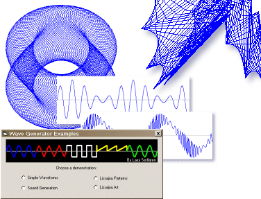



## Wave Generator

### Description

The Wave Generator is an ActiveX component used to produce wave images and files. The included demo shows how to produce various waveforms and a concise method to play them as sounds. Only source code files are included in the package. It is up to you to make the component for use in your own projects and games. See the Wave Generator ReadMe file for instructions. Have fun!
 
### More Info
 

             |
---                |---
**Submitted On**   |2009-04-11 21:20:42
**By**             |[Larry Serflaten](https://github.com/Planet-Source-Code/PSCIndex/blob/master/ByAuthor/larry-serflaten.md)
**Level**          |Intermediate
**User Rating**    |4.7 (14 globes from 3 users)
**Compatibility**  |VB 5\.0, VB 6\.0
**Category**       |[OLE/ COM/ DCOM/ Active\-X](https://github.com/Planet-Source-Code/PSCIndex/blob/master/ByCategory/ole-com-dcom-active-x__1-29.md)
**World**          |[Visual Basic](https://github.com/Planet-Source-Code/PSCIndex/blob/master/ByWorld/visual-basic.md)
**Archive File**   |[Wave\_Gener2149494112009\.ZIP](https://github.com/Planet-Source-Code/larry-serflaten-wave-generator__1-71979/archive/master.zip)

